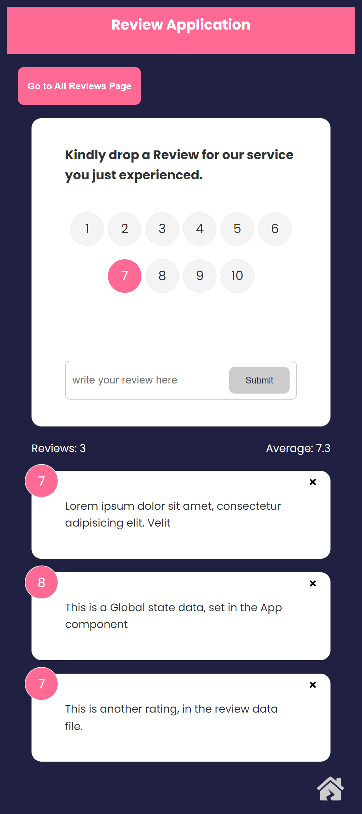

# ACE Review App

Welcome to the ACE Review App, developed by the Women Techsters Fellowship Class of 2024.

## Overview

The ACE Review App is a platform designed to collect ratings and reviews from intending users. Whether you're seeking feedback on a product, service, or experience, our application provides a user-friendly interface to gather valuable insights.

## Features

- **User Ratings:** Allow users to provide numerical ratings.
- **Reviews:** Capture detailed feedback and comments from users.
- **User-Friendly Interface:** Intuitive design for a seamless user experience.

## Team ACE - Women Techsters Fellowship Class of 2024

We are a dynamic team of developers passionate about creating innovative solutions. Check out our organisation projects here => [https://github.com/Tech4dev-Fellows-24-ACE-group-Front-End](https://github.com/Tech4dev-Fellows-24-ACE-group-Front-End)

## How to Use

1. **Submit Ratings:** Provide numerical ratings based on your experience.
2. **Write a Review:** Share your detailed feedback and comments.
3. **Explore Reviews:** Browse through reviews submitted by other users.

## Screenshots

